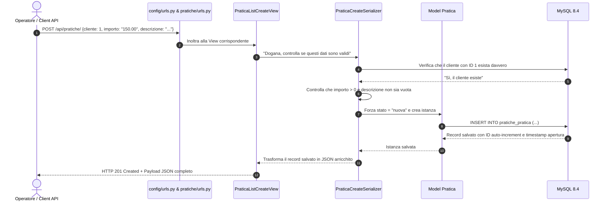

# Mappa del Progetto — Guida Visuale e Concettuale

Questa mappa serve a comprendere il funzionamento dell'intero sistema a colpo d'occhio, seguendo il flusso delle informazioni senza perdersi nei dettagli del codice.

---

## 1. I Tre Protagonisti di Django (Metafora Terra-Terra)

Quando arriva una chiamata dall'esterno, Django fa interagire tre figure fondamentali:

```text
[ Richiesta HTTP ]
        │
        ▼
   1. LA VIEW  ─────────> Il Vigile Urbano
        │                 Riceve la richiesta, capisce cosa vuole il client (GET? POST? PATCH?)
        │                 e chiama gli specialisti giusti.
        ▼
 2. IL SERIALIZER ──────> La Dogana / Controllo Qualità
        │                 Apre il pacchetto JSON. Controlla che i dati siano corretti,
        │                 obbligatori e nel formato giusto. Se c'è un errore, risponde subito
        │                 in italiano e blocca tutto. Se è valido, lo trasforma in oggetto Python.
        ▼
   3. IL MODEL  ────────> Il Notaio e l'Archivio
        │                 Rappresenta la tabella sul database MySQL. Custodisce le regole sacre
        │                 del business (es. la macchina a stati e i vincoli monetari) e scrive sul disco.
        ▼
  [ Database MySQL ]
```

---

## 2. Il Viaggio di una Richiesta (Passo dopo Passo)

### Scenario: Creazione di una nuova pratica (`POST /api/pratiche/`)



---

## 3. Mappa della Macchina a Stati delle Pratiche

La pratica ha un ciclo di vita rigido a senso unico:

```text
               (Creazione automatica)
                         │
                         ▼
                   ┌───────────┐
      ┌───────────>│   NUOVA   │
      │            └─────┬─────┘
      │ (conferma)       │
      │                  │ Presa in carico
      │                  ▼
      │            ┌───────────┐
      ├───────────>│IN_LAVORAZ.│
      │            └─────┬─────┘
      │ (conferma)       │
      │                  │ Conclusione pratica
      │                  ▼
      │            ┌───────────┐
      └───────────>│  CHIUSA   │ (Stato finale irreversibile)
        (conferma) └───────────┘
```

### Regole ferree del Notaio (Model):
- **Da NUOVA:** puoi solo restare NUOVA o passare a IN_LAVORAZIONE. Saltare direttamente a CHIUSA è vietato.
- **Da IN_LAVORAZIONE:** puoi solo restare IN_LAVORAZIONE o passare a CHIUSA. Tornare indietro a NUOVA è vietato.
- **Da CHIUSA:** non puoi andare da nessuna parte. Una pratica chiusa non si riapre mai.
- **Riconferma (Idempotenza):** se chiedi di impostare lo stato in cui la pratica si trova già, l'operazione ha successo senza riscrivere il database.

---

## 4. Albero dei File del Repository

Ecco cosa fa ogni singolo file del progetto, spiegato in una riga:

```text
prova-debitoo/
│
├── config/                               # Impostazioni generali del progetto
│   ├── settings.py                       # Registrazione app, connessione MySQL, lingua italiana
│   ├── urls.py                           # Il centralino principale: smista il traffico verso le app
│   └── exceptions.py                     # Traduttore universale per errori 404 in italiano pulito
│
├── customers/                            # App 1: Anagrafica persone
│   ├── models.py                         # Tabella Cliente: nome, cognome, email unica nel DB
│   ├── serializers.py                    # Validatore: pulisce l'email e blocca duplicati case-insensitive
│   ├── views.py                          # Gestore HTTP per creare il cliente
│   ├── urls.py                           # Rotte: /api/customers/ (e alias /api/clienti/)
│   └── tests.py                          # 4 test automatici di creazione cliente
│
├── pratiche/                             # App 2: Gestione pratiche debitorie
│   ├── models.py                         # Tabella Pratica: importo decimale, stato, check-constraint DB
│   ├── serializers.py                    # Serializer distinti: creazione, lettura arricchita, cambio stato
│   ├── views.py                          # Endpoint: elenco filtrabile (?stato=), dettaglio e PATCH stato
│   ├── urls.py                           # Rotte: /api/pratiche/ e /api/pratiche/<id>/
│   ├── tests.py                          # 15 test automatici: coprono tutti i percorsi lecite e illeciti
│   └── management/commands/seed_data.py  # Comando per caricare dati realistici con un solo click
│
├── compose.yaml                          # Configurazione orchestrata per Django + MySQL 8.4
├── Dockerfile                            # Costruzione dell'immagine applicativa con Python 3.12 e uv
└── pyproject.toml / uv.lock              # Elenco esatto delle librerie usate e bloccate
```

---

## 5. Grafo delle Chiamate e Relazioni Estratto da AST (MCP code-intel)

Grazie all'analisi con il nostro MCP `code-intel`, la codebase è stata mappata e indicizzata a livello di simboli:

| Simbolo | Tipo | File | Chi lo chiama / Scopo |
|---|---|---|---|
| `Customer` | Model | `customers/models.py` | Riferito come ForeignKey da `Pratica` con protezione `models.PROTECT`. |
| `CustomerSerializer` | Serializer | `customers/serializers.py` | Usato in `CustomerCreateView` e riusato dentro `PraticaReadSerializer`. |
| `StatoPratica` | TextChoices | `pratiche/models.py` | Enum dei 3 stati validi (`nuova`, `in_lavorazione`, `chiusa`). |
| `Pratica` | Model | `pratiche/models.py` | Contiene i vincoli di business e il `CheckConstraint` su MySQL. |
| `puo_transitare_a` | Metodo | `pratiche/models.py` | Consulta la matrice statica `TRANSIZIONI_PERMESSE`. |
| `valida_transizione` | Metodo | `pratiche/models.py` | Solleva errori dettagliati in italiano in caso di transizione illegale. |
| `PraticaCreateSerializer` | Serializer | `pratiche/serializers.py` | Forza lo stato a `nuova` e valida che il cliente esista. |
| `PraticaStatoUpdateSerializer` | Serializer | `pratiche/serializers.py` | Blocca payload vuoti e coordina il cambio di stato. |
| `PraticaListCreateView` | View | `pratiche/views.py` | Gestisce GET con filtro e POST, usando `select_related('cliente')` per evitare query N+1. |
| `PraticaDetailView` | View | `pratiche/views.py` | Gestisce GET singolo e PATCH per il cambio di stato. |
| `Command` (seed_data) | Management Command | `pratiche/management/commands/` | Popola 3 clienti e 5 pratiche con transazione atomica protetta. |
