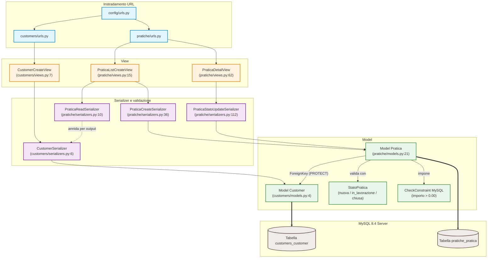

# Mappa della codebase

Questa mappa deriva dall'analisi dell'AST (Abstract Syntax Tree) e del grafo delle chiamate eseguita dal tool MCP `code-intel`, basato su `mcp-context-graph` e integrato in NeXgen Engine.

L'export dell'analisi è disponibile in [docs/code_intel_graph.json](docs/code_intel_graph.json).

---

## 1. Metriche

L'analisi ha prodotto questi dati:

| Metrica MCP | Valore | Significato pratico |
|---|---|---|
| File analizzati | 28 processati su 40 scoperti | Sono esclusi file temporanei, cache e migrazioni storiche. |
| Nodi AST | 156 | Classi, funzioni, metodi e costanti. |
| Relazioni | 186 | Chiamate, import ed ereditarietà rilevati dal grafo. |
| Contesto | Da 50.557 B a 5.757 B | La vista del grafo riduce il testo da caricare di circa 8,8 volte. |

---

## 2. Grafo delle dipendenze

Il diagramma mostra il percorso tra routing, view, serializer, model e database:



---

## 3. Definizioni con più chiamanti

`code-intel` ordina queste definizioni per numero di chiamanti:

| Simbolo | File | Riga | Callers | Ruolo |
|---|---|---|---|---|
| `create` | `pratiche/serializers.py` | 97 | 13 | Crea la pratica e imposta lo stato iniziale `nuova`. |
| `PraticaReadSerializer` | `pratiche/serializers.py` | 10 | 2 | Prepara le risposte di lista, dettaglio e creazione. |
| `CustomerSerializer` | `customers/serializers.py` | 6 | 1 | Valida il cliente ed è incluso nella risposta della pratica. |
| `valida_transizione` | `pratiche/models.py` | 122 | 1 | Rifiuta le transizioni di stato non consentite. |
| `puo_transitare_a` | `pratiche/models.py` | 115 | 1 | Controlla se il nuovo stato è ammesso. |
| `clean` | `pratiche/models.py` | 105 | 1 | Verifica che l'importo sia positivo. |
| `get_object` | `pratiche/views.py` | 73 | 1 | Restituisce `"Pratica non trovata."` quando l'identificativo non esiste. |

---

## 4. Struttura dei file

L'AST contiene queste definizioni principali:

### `customers/`
- `models.py:4`: `class Customer(models.Model)`
  - Campi: `first_name`, `last_name`, `email` (unique=True).
- `serializers.py:6`: `class CustomerSerializer(serializers.ModelSerializer)`
  - Metodo: `validate_email(value)` (normalizzazione e verifica case-insensitive).
- `views.py:7`: `class CustomerCreateView(CreateAPIView)`
  - Endpoint `POST /api/customers/` (alias `/api/clienti/`).

### `pratiche/`
- `models.py:8`: `class StatoPratica(models.TextChoices)`
  - Valori: `NUOVA ("nuova")`, `IN_LAVORAZIONE ("in_lavorazione")`, `CHIUSA ("chiusa")`.
- `models.py:21`: `class Pratica(models.Model)`
  - Campi: `cliente` (FK PROTECT), `descrizione`, `importo` (Decimal), `stato`, `creata_il`, `aggiornata_il`.
  - Vincolo SQL: `CheckConstraint(importo > 0.00, name="pratica_importo_positivo")`.
  - Metodi: `clean()`, `puo_transitare_a(nuovo_stato)`, `valida_transizione(nuovo_stato)`.
- `serializers.py:10`: `class PraticaReadSerializer(serializers.ModelSerializer)`
  - Restituisce i campi della pratica arricchiti con l'anagrafica cliente annidata.
- `serializers.py:36`: `class PraticaCreateSerializer(serializers.ModelSerializer)`
  - Valida l'input iniziale e forza `stato = "nuova"`.
- `serializers.py:112`: `class PraticaStatoUpdateSerializer(serializers.ModelSerializer)`
  - Valida che `stato` sia presente (anche in `PATCH {}` parziale) e invoca `valida_transizione`.
- `views.py:15`: `class PraticaListCreateView(ListCreateAPIView)`
  - `get_queryset()`: esegue `select_related('cliente')` e gestisce il filtro `?stato=`.
- `views.py:62`: `class PraticaDetailView(RetrieveUpdateAPIView)`
  - Gestisce la lettura singola e il `PATCH` dello stato con messaggi 404 localizzati.
- `management/commands/seed_data.py:17`: `class Command(BaseCommand)`
  - Inserisce 3 clienti e 5 pratiche di prova dentro una transazione atomica (`transaction.atomic`).

### `config/`
- `exceptions.py:7`: `def italian_exception_handler(exc, context)`
  - Traduce le risposte 404 standard DRF in italiano pulito.

---

## 5. Ruolo dei componenti Django

Nel flusso di una richiesta:

1. La view riceve il metodo HTTP e sceglie il serializer adatto.
   Per le liste usa `select_related('cliente')`, così Django carica pratica e cliente con una sola query.

2. Il serializer legge il JSON e valida campi, email, importo e stato.
   Se i dati non sono validi restituisce `400 Bad Request` con un messaggio in italiano.

3. Il model descrive lo schema e contiene le regole sulle transizioni.
   Il `CheckConstraint` impedisce di salvare un importo non positivo anche con una scrittura diretta sul database.

---

## 6. Comandi `code-intel`

`code-intel` è disponibile tramite `lazy-mcp`:

```bash
# Esempio di interrogazione via protocollo MCP:
# 1. repo_map: restituisce il riassunto dell'AST e le top definitions
call_tool lazy-mcp lazy_call { server: "code-intel", tool: "repo_map", arguments: { repo: "/percorso/assoluto/prova-debitoo" } }

# 2. find_callers: mostra chi usa una funzione prima di modificarla
call_tool lazy-mcp lazy_call { server: "code-intel", tool: "find_callers", arguments: { repo: "/percorso/assoluto/prova-debitoo", name: "valida_transizione" } }
```
