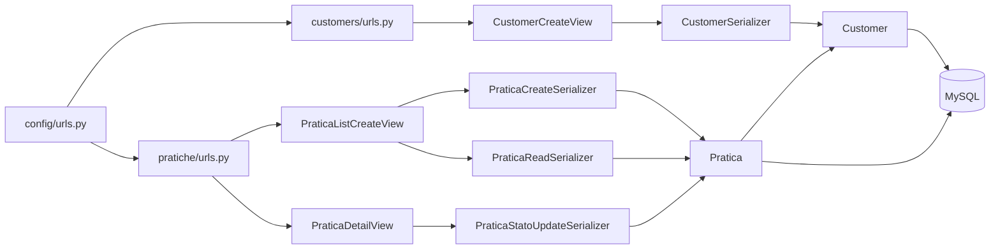

# Mappa della codebase

Questa mappa deriva dall'analisi AST eseguita con `code-intel`, tool MCP di NeXgen Engine basato su `mcp-context-graph`.
L'[export completo](docs/code_intel_graph.json) contiene i dati prodotti dall'analisi.

## Metriche

| Dato | Valore |
|---|---:|
| File processati | 28 su 40 |
| Nodi AST | 156 |
| Relazioni | 186 |
| Chiamate risolte | 22 |
| Contesto sorgente | 50.557 B |
| Vista del grafo | 5.757 B |
| Riduzione | 8,8 volte |

File temporanei, cache e migrazioni storiche non rientrano nei 28 file processati.

## Flusso delle richieste



## Responsabilità dei file

| File | Responsabilità |
|---|---|
| `config/urls.py` | Collega gli URL delle due applicazioni. |
| `config/exceptions.py` | Traduce la risposta 404 standard. |
| `customers/models.py` | Definisce nome, cognome ed email univoca. |
| `customers/serializers.py` | Valida e normalizza i dati del cliente. |
| `customers/views.py` | Gestisce `POST /api/customers/`. |
| `pratiche/models.py` | Definisce pratica, stati, transizioni e vincolo sull'importo. |
| `pratiche/serializers.py` | Separa creazione, lettura e aggiornamento dello stato. |
| `pratiche/views.py` | Gestisce creazione, lista, filtro, dettaglio e `PATCH`. |
| `pratiche/management/commands/seed_data.py` | Carica tre clienti e cinque pratiche in una transazione. |

La view instrada la richiesta e sceglie il serializer.
Il serializer valida il JSON.
Il model descrive lo schema e contiene le regole di dominio.
`select_related("cliente")` carica pratica e cliente con una query.
Il `CheckConstraint` impedisce importi non positivi anche con una scrittura diretta sul database.

## Simboli con più chiamanti

| Simbolo | File | Callers | Ruolo |
|---|---|---:|---|
| `create` | `pratiche/serializers.py` | 13 | Crea la pratica nello stato `nuova`. |
| `PraticaReadSerializer` | `pratiche/serializers.py` | 2 | Prepara lista, dettaglio e risposta di creazione. |
| `CustomerSerializer` | `customers/serializers.py` | 1 | Valida il cliente e lo include nella pratica. |
| `valida_transizione` | `pratiche/models.py` | 1 | Rifiuta le transizioni vietate. |
| `puo_transitare_a` | `pratiche/models.py` | 1 | Controlla il nuovo stato. |
| `clean` | `pratiche/models.py` | 1 | Verifica l'importo. |
| `get_object` | `pratiche/views.py` | 1 | Restituisce la risposta 404 italiana. |

## Comandi `code-intel`

```bash
call_tool lazy-mcp lazy_call { server: "code-intel", tool: "repo_map", arguments: { repo: "/percorso/assoluto/prova-debitoo" } }

call_tool lazy-mcp lazy_call { server: "code-intel", tool: "find_callers", arguments: { repo: "/percorso/assoluto/prova-debitoo", name: "valida_transizione" } }
```
