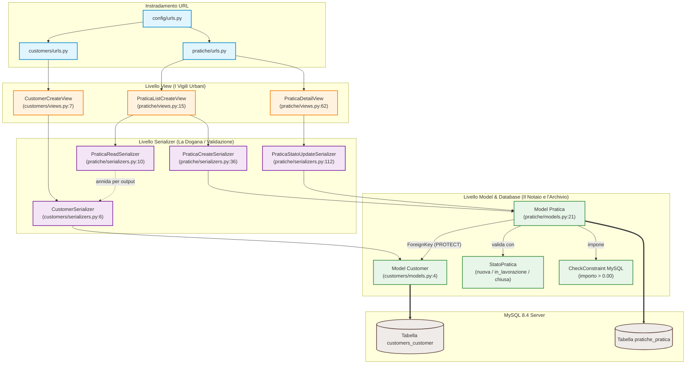

# Mappa Strutturale della Codebase (MCP `code-intel`)

Questa mappa è generata direttamente a partire dall'analisi dell'AST (Abstract Syntax Tree) e del grafo delle chiamate effettuata dal server MCP privato **`code-intel`** (motore `mcp-context-graph`).

Il file grezzo esportato dall'MCP è consultabile in [docs/code_intel_graph.json](docs/code_intel_graph.json).

---

## 1. Metriche del Grafo MCP

L'analisi automatica della codebase ha prodotto i seguenti indicatori strutturali:

| Metrica MCP | Valore | Significato pratico |
|---|---|---|
| **File analizzati** | 28 processati (su 40 scoperti) | Esclusi file temporanei, cache e migrazioni storiche. |
| **Nodi del codice (AST)** | **156 nodi** | Classi, funzioni, metodi e costanti mappati univocamente. |
| **Archi / Relazioni** | **186 archi** | Connessioni effettive tra chiamanti, chiamati ed ereditarietà. |
| **Footprint di contesto** | Da 50.557 B a 5.757 B | **Compressione 8.8x**: l'agente e l'umano leggono le firme e le relazioni essenziali invece di migliaia di righe grezze. |

---

## 2. Il Grafo Reale delle Chiamate e Dipendenze (Mermaid)

Questo diagramma rappresenta le relazioni estratte dall'AST tra le classi e le funzioni del progetto:



---

## 3. Top Definitions rilevate da `code-intel` (Callers & Blast Radius)

I punti nevralgici della codebase ordinati per numero di chiamanti (identificati automaticamente dall'analizzatore AST):

| Simbolo | File | Riga | Callers | Perché è un nodo critico |
|---|---|---|---|---|
| `create` | `pratiche/serializers.py` | 97 | **13** | Punto in cui la pratica viene creata e lo stato viene forzato tassativamente a `nuova`. |
| `PraticaReadSerializer` | `pratiche/serializers.py` | 10 | **2** | Serializer condiviso sia per le risposte di lista/dettaglio sia per il feedback post-creazione. |
| `CustomerSerializer` | `customers/serializers.py` | 6 | **1** | Usato per validare la registrazione cliente e riusato all'interno di `PraticaReadSerializer`. |
| `valida_transizione` | `pratiche/models.py` | 122 | **1** | Cuore logico della macchina a stati: solleva `ValidationError` in caso di passaggi non permessi. |
| `puo_transitare_a` | `pratiche/models.py` | 115 | **1** | Metodo booleano interrogato dalla validazione per verificare l'ammissibilità dello stato. |
| `clean` | `pratiche/models.py` | 105 | **1** | Validatore applicativo dell'importo positivo eseguito prima di ogni scrittura. |
| `get_object` | `pratiche/views.py` | 73 | **1** | Intercetta `Http404` per restituire il messaggio in lingua italiana `"Pratica non trovata."`. |

---

## 4. Outline Completo dei File (Estratto Statico AST)

La scansione dei file sorgente ha registrato le seguenti definizioni formali:

### `customers/`
- **`models.py:4`**: `class Customer(models.Model)`
  - Campi: `first_name`, `last_name`, `email` (unique=True).
- **`serializers.py:6`**: `class CustomerSerializer(serializers.ModelSerializer)`
  - Metodo: `validate_email(value)` (normalizzazione e verifica case-insensitive).
- **`views.py:7`**: `class CustomerCreateView(CreateAPIView)`
  - Endpoint `POST /api/customers/` (alias `/api/clienti/`).

### `pratiche/`
- **`models.py:8`**: `class StatoPratica(models.TextChoices)`
  - Valori: `NUOVA ("nuova")`, `IN_LAVORAZIONE ("in_lavorazione")`, `CHIUSA ("chiusa")`.
- **`models.py:21`**: `class Pratica(models.Model)`
  - Campi: `cliente` (FK PROTECT), `descrizione`, `importo` (Decimal), `stato`, `creata_il`, `aggiornata_il`.
  - Vincolo SQL: `CheckConstraint(importo > 0.00, name="pratica_importo_positivo")`.
  - Metodi: `clean()`, `puo_transitare_a(nuovo_stato)`, `valida_transizione(nuovo_stato)`.
- **`serializers.py:10`**: `class PraticaReadSerializer(serializers.ModelSerializer)`
  - Restituisce i campi della pratica arricchiti con l'anagrafica cliente annidata.
- **`serializers.py:36`**: `class PraticaCreateSerializer(serializers.ModelSerializer)`
  - Valida l'input iniziale e forza `stato = "nuova"`.
- **`serializers.py:112`**: `class PraticaStatoUpdateSerializer(serializers.ModelSerializer)`
  - Valida che `stato` sia presente (anche in `PATCH {}` parziale) e invoca `valida_transizione`.
- **`views.py:15`**: `class PraticaListCreateView(ListCreateAPIView)`
  - `get_queryset()`: esegue `select_related('cliente')` e gestisce il filtro `?stato=`.
- **`views.py:62`**: `class PraticaDetailView(RetrieveUpdateAPIView)`
  - Gestisce la lettura singola e il `PATCH` dello stato con messaggi 404 localizzati.
- **`management/commands/seed_data.py:17`**: `class Command(BaseCommand)`
  - Inserisce 3 clienti e 5 pratiche di prova dentro una transazione atomica (`transaction.atomic`).

### `config/`
- **`exceptions.py:7`**: `def italian_exception_handler(exc, context)`
  - Traduce le risposte 404 standard DRF in italiano pulito.

---

## 5. La Metafora dei Tre Componenti (Spiegazione Concreta)

Per orientarsi senza dover ricordare a memoria la sintassi Python:

1. **La View è il Vigile Urbano**:
   - Sta all'incrocio tra la rete e l'applicazione.
   - Non sa se il codice fiscale o l'importo sono giusti: guarda solo il metodo HTTP (`GET`, `POST`, `PATCH`) e passa la palla allo specialista giusto.
   - Per le liste applica `select_related('cliente')` per dire a MySQL: *"Fai una sola JOIN, non fare cinquanta query separate"*.

2. **Il Serializer è la Dogana**:
   - Apre il pacco JSON inviato dal client.
   - Controlla se mancano campi obbligatori, se l'email è scritta bene o se l'importo è negativo.
   - Se c'è un errore, risponde subito al client con codice 400 e la spiegazione in italiano.
   - Se è tutto valido, traduce il JSON in dati che il Model può salvare.

3. **Il Model è il Notaio**:
   - È il custode delle regole assolute e della tabella fisica su MySQL.
   - Custodisce il dizionario `TRANSIZIONI_PERMESSE`. Se qualcuno prova a passare una pratica da `chiusa` a `in_lavorazione`, il Notaio si rifiuta di firmare e solleva un'eccezione.
   - È collegato al vincolo `CheckConstraint` sul motore MySQL: anche se qualcuno provasse a inserire un debito di -50 € direttamente dal terminale del database, MySQL rifiuterebbe l'operazione.

---

## 6. Come Interrogare l'MCP `code-intel`

L'analizzatore fa parte dell'infrastruttura NeXgen Engine ed è invocabile da qualsiasi agente o da terminale tramite `lazy-mcp`:

```bash
# Esempio di interrogazione via protocollo MCP:
# 1. repo_map: restituisce il riassunto dell'AST e le top definitions
call_tool lazy-mcp lazy_call { server: "code-intel", tool: "repo_map", arguments: { repo: "/percorso/assoluto/prova-debitoo" } }

# 2. find_callers: mostra chi usa una funzione prima di modificarla
call_tool lazy-mcp lazy_call { server: "code-intel", tool: "find_callers", arguments: { repo: "/percorso/assoluto/prova-debitoo", name: "valida_transizione" } }
```
